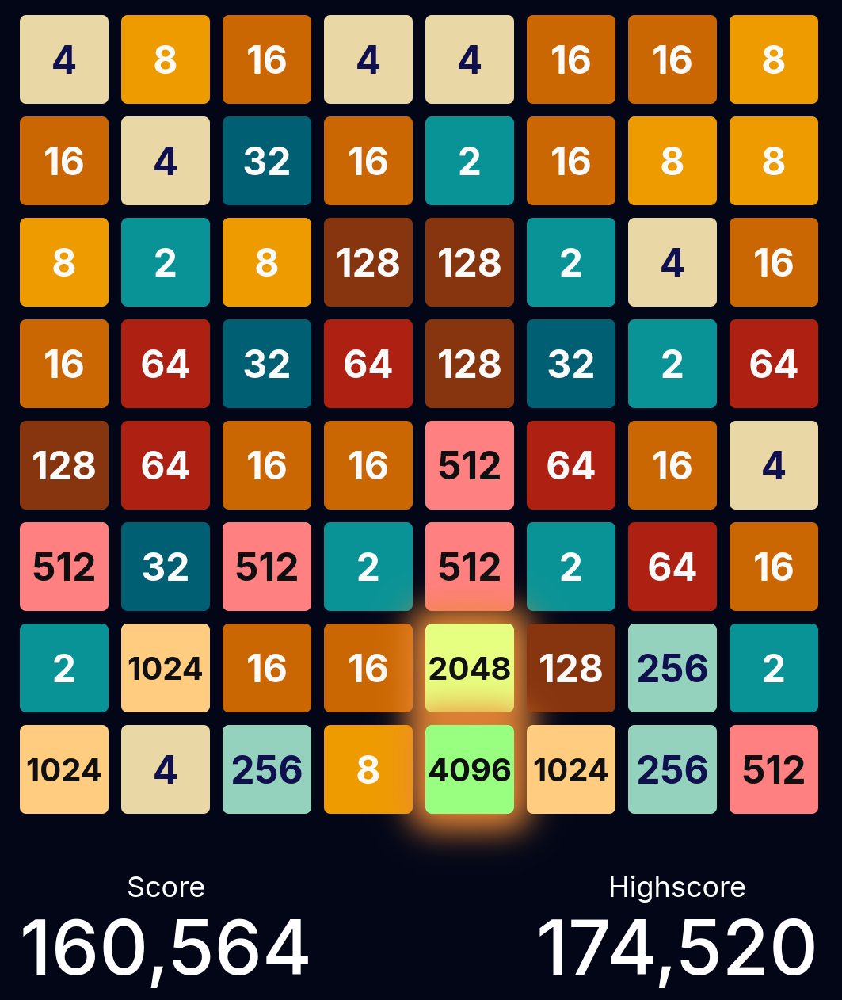

#+title: Exponentile

This is an extension to the original MikeBellika/tile-game

- https://github.com/MikeBellika/tile-game
- https://bellika.dk/exponentile

You can play this fork at

- https://brettviren.github.io/tile-game/

There is also an APK, see below.  See also caveats at the end.

* The path I'm walking

This fork has the following completed and planned changes:

- [X] Builds/runs with deno.
- [X] Saves elapsed time.
- [X] Adds a game history page.
- [X] Merges upstream's feature/sound branch.
- [X] Adds a single undo.
- [X] Allows serving from a URL sub-path.
- [X] Publishes to GitHub pages.
- [X] Add full screen and touch-none to help on mobile.
- [X] Is a PWA ("save to home screen").
- [X] Attempts to conserve battery for mobile use.
- [X] Store last state in history.
- [X] Revisit last state as full board.
- [X] Fix regression: new tiles flash to white after a board touch but they should do complete this when they appear.
- [X] Add timer pause
- [X] Allow setting seed via URL parameter.
  - eg append ~?seed=12345~ to the URL
- [X] fix regression so reloading page does not revert timer.
- [X] History: Add link to replay a given seed on seed entry.
- [X] History: sort by duration.
- [X] Make "instant" speed closer to actually being instantaneous and add "turbo" as a faster version of the old "instant".
- [X] Fixed color transition delay (reduced from 700ms to match animation speed)
- [X] Fix regression where the boar refuses to accept legal moves (missing try/finally)
- [X] Fix regression where new tiles "push down" the board, corrupting it and causing general chaos (PRNG silently overflows max safe integer which screws up tile IDs).
- [ ] Convert from local storage to indexdb
- [ ] History: plot distributions of scores, duration and moves.
- [ ] History: plot scores, duration and moves vs time.
- [ ] Store all moves.
- [ ] Replay games.
- [ ] Link to download data as JSON.
- [X] Get android app with this fork building again.
- [ ] Include APK as release product.
- [ ] Automate building APK and web.

* Build web

Run locally:

#+begin_example
$ deno task build
$ deno task serve
#+end_example

Note, the build sometimes hangs while =deno= and other tools show no CPU usage.  I don't know the reason but this seems to clear up what is going bad:

#+begin_example
$ rm -r out
$ deno task build
#+end_example

To publish to github pages.

#+begin_example
./publish.sh
#+end_example

* Build the APK

** Prep

Something like:

#+begin_example
mkdir -p ~/Android/Sdk/cmdline-tools
cd ~/Android/Sdk/cmdline-tools
curl -O https://dl.google.com/android/repository/commandlinetools-linux-11076708_latest.zip
unzip commandlinetools-linux-11076708_latest.zip
mv cmdline-tools latest
#+end_example

** Build and install to phone

#+begin_example
export ANDROID_HOME=$HOME/Android/Sdk
./build-apk.sh
adb uninstall dk.bellika.exponentile
adb install android/app/build/outputs/apk/debug/app-debug.apk
#+end_example

* Caveats

I may update the web app on github.io from time to time.  There is no attempt to
do schema evolution on the data stored in your browser's Local Storage for this
site.  Old data and a new site can be inconsistent.  Sometimes a hard reload is
enough and sometimes one needs to go to Inspect->Storage->Local Storage, select
the site and delete.  When I stop messing about, I'll remove this caveat.

This fork is largely vibe coded.  I do look at the produced code for sanity but
there is no guarantee that this fork does not ruin all that you hold dear.
Please do not pester the original author with any problems you may encounter
(nor me for that matter) with thisfork.  But, do thank him for providing a deeply engrossing game!

